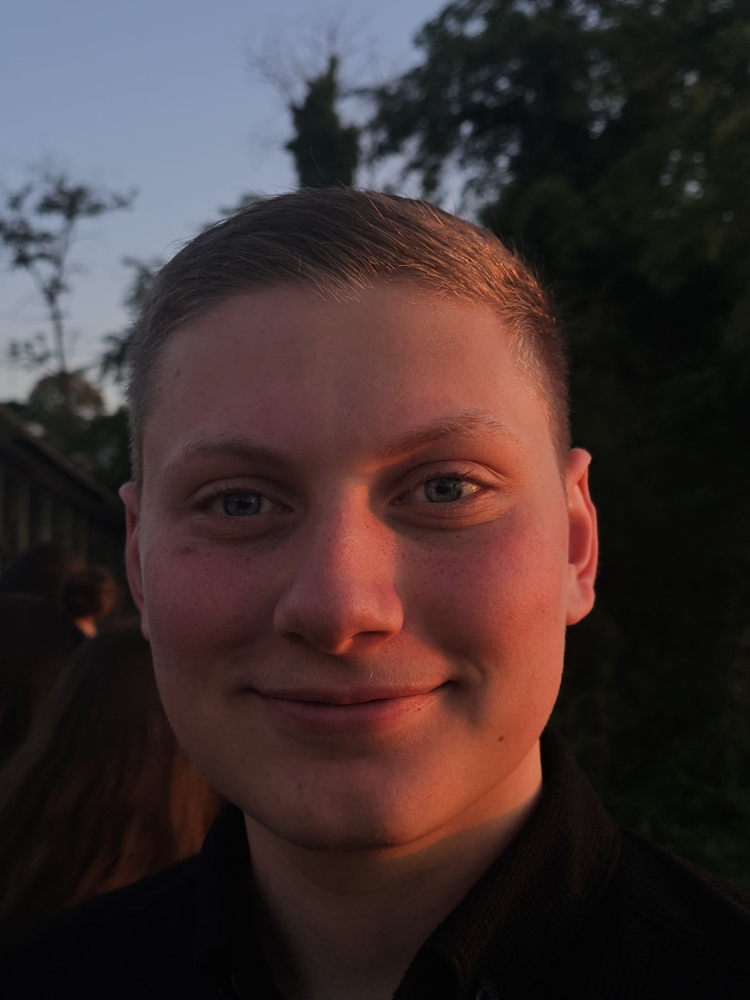
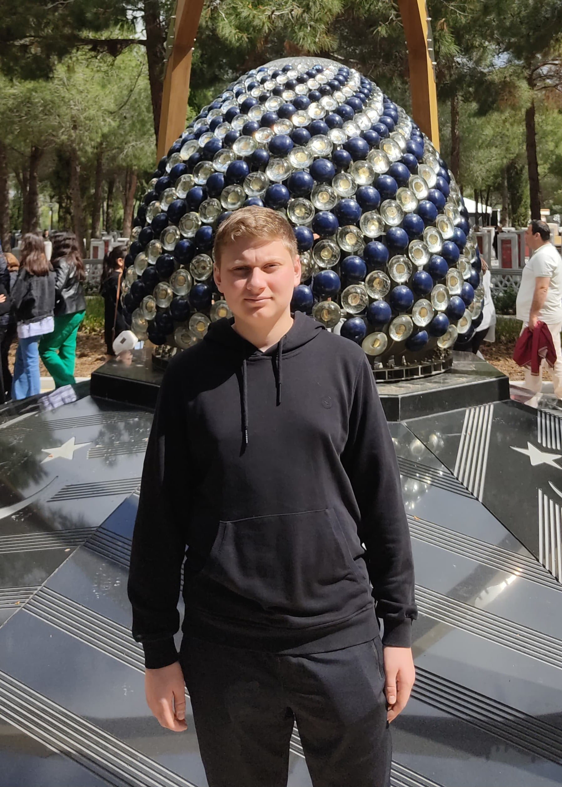
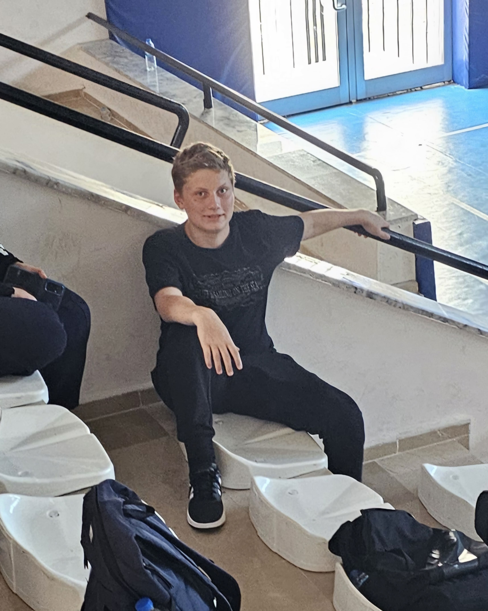
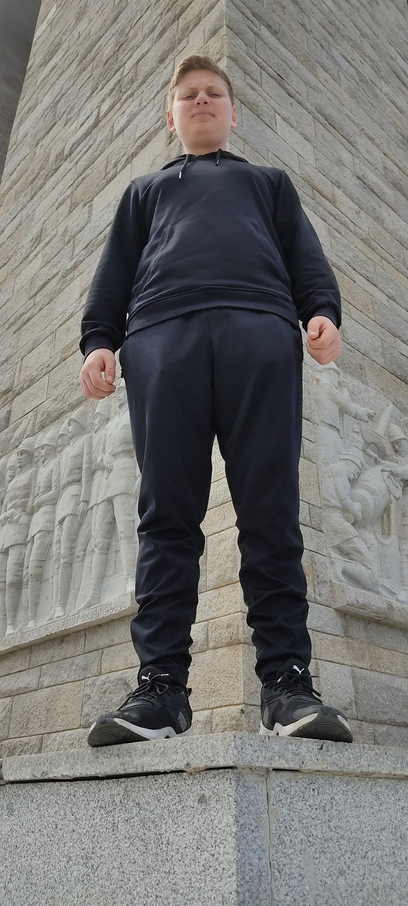

<html lang="tr">
<head>
  <meta charset="UTF-8">
  <title>Başkanım Doğum Günün Kutlu Olsun 🎂</title>
  
</head>
<body>
  <h1>🎂 Başkanım Doğum Günün Kutlu Olsun 🎂</h1>
  
Başkanım Doğum günün kutlu olsun. Geç kalınca farklı bir şey yapayım dedim. Seviliyorsun Başki ❤️

  

    
    
    
    
    
  

  <!-- Trabzonspor marşı (YouTube embed) -->
  <iframe width="0" height="0" src="https://www.youtube.com/embed/NnWc1SWh4lg?autoplay=1&loop=1" frameborder="0" allow="autoplay"></iframe>

  <footer>Hazırlayan: Orucun ❤️</footer>

  
</body>
</html>
